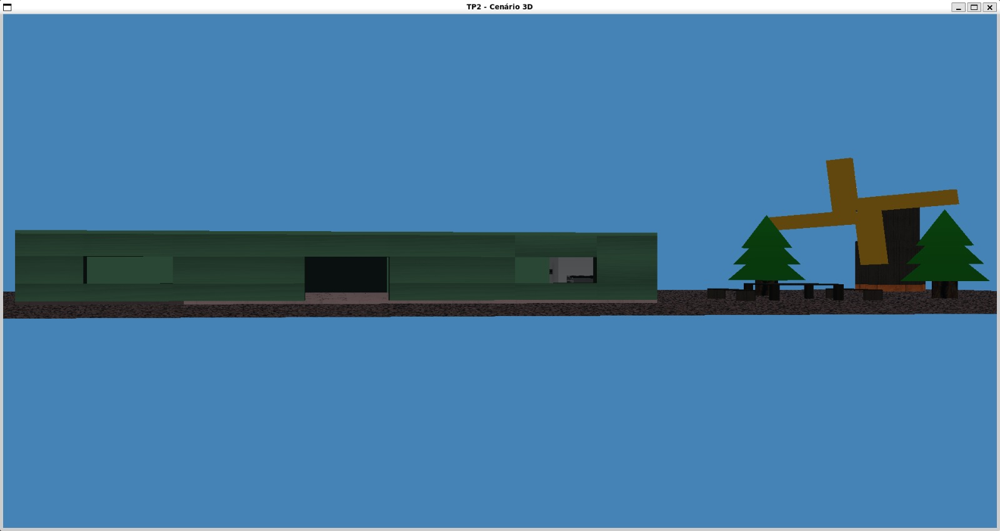

<h1 align="center">
    <p>Trabalho de Computação Gráfica - Cenário 3D</p>
    
    <p>Desperte sua imaginação e mergulhe em um cenário 3D envolvente, repleto de luz, arquitetura e interatividade!</p>
</h1>

## 📚 Visão Geral

O projeto "Trabalho Prático 2 (mini)" consiste na criação de um cenário 3D navegável com uma casa de 4 cômodos, móveis distribuídos, árvores e um moinho de vento em rotação. O cenário inclui iluminação detalhada e efeitos de luz ambiente, difusa e especular.

Tal projeto é um trabalho que foi desenvolvido para a disciplina de Computação Gráfica a pedido do professor André do Centro Federal de Educação Tecnológica de Minas Gerais.
    
## 🎮 Preview

<p align="center">
    Clique na imagem abaixo e assista a gameplay, vídeo no qual é detalhado de forma mais lúcida o funcionamento do programa.
    <a href="https://www.youtube.com/watch?v=FUpU-imlW-A">
        
    </a>
</p>

## 🛑 Requisitos do Sistema

Para executar o projeto em sua máquina, certifique-se de ter os seguintes requisitos:

1. Um computador com sistema operacional Windows, Linux ou macOS.
2. Compilador C compatível com o padrão C99.
3. Bibliotecas gráficas instaladas (como o OpenGL)

## 🖥️Instalação

Siga as etapas abaixo para instalar e executar o programa:

1. Clone ou faça o download do repositório do projeto.

2. Certifique-se de ter instalado o compilador C e as bibliotecas gráficas necessárias no seu sistema.

3. Navegue até o diretório do projeto no terminal.

4. Compile e execute o código-fonte pelo terminal, abrindo-o na pasta do projeto e digite o seguinte comando:

    ```
    make run
    ```
    Existe um arquivo Makefile disponível na pasta, que foi criado para facilitar a compilação e execução do programa, independentemente do sistema operacional utilizado.

## ⌨️ Uso

- Usar as teclas '1', '2', '3' e '4' para acender e apagar as respectivas fontes de luz da casa.
- Usar a tecla '5' para acender e apagar a fonte de luz externa.
- Ajustar a intensidade das componentes da fonte de luz externa usando as teclas '+' e '-' dentro do intervalo [0, 1].
- Para aumentar e diminuir a intensidade da névoa use as teclas 'o' e 'p', respectivamente.
- Navegue pelo cenário usando as teclas 'w' (deslocamento para frente), 'a' (deslocamento para esquerda), 's' (deslocamento para trás) e 'd' (deslocamento para direita).
- Altere a caixa de visualizão por meio do mouse.

## 💡 Contribuição

Este projeto foi desenvolvido como parte de um trabalho da faculdade e, portanto, não está aberto a contribuições externas no momento.

## 🫂 Agradecimentos

Gostaríamos de expressar nossos agradecimentos a todas as pessoas envolvidas no desenvolvimento deste trabalho.
Agradecemos aos membros da equipe, abaixo listados, que contribuíram com seu tempo, esforço e ideias para tornar este projeto uma realidade.

- Aira Winner Sousa Ramos Torres    | Matrícula: 20223010346
- Eduardo Morais Silva Martins      | Matrícula: 20223009265
- Gabriel Araujo Barbosa            | Matrícula: 20223003305
- Luan Marcelino de Souza           | Matrícula: 20223010435 
- Milena Bueno Maciel               | Matrícula: 20223007912

Também gostaríamos de estender nossos agradecimentos ao professor André de Computação Gráfica que forneceu orientação e suporte ao longo do desenvolvimento do programa.
